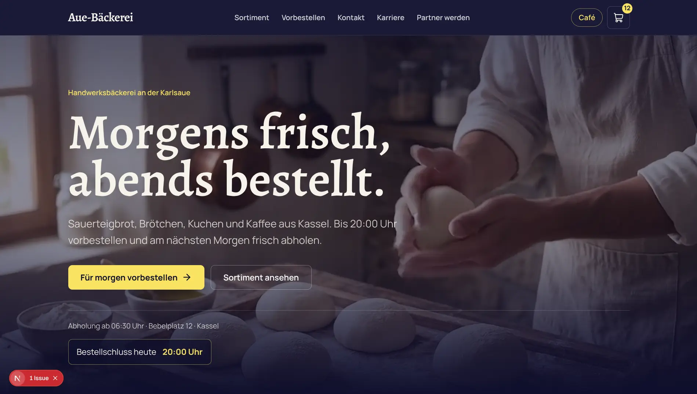
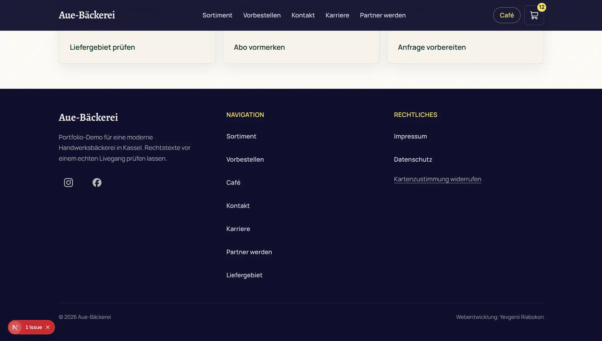
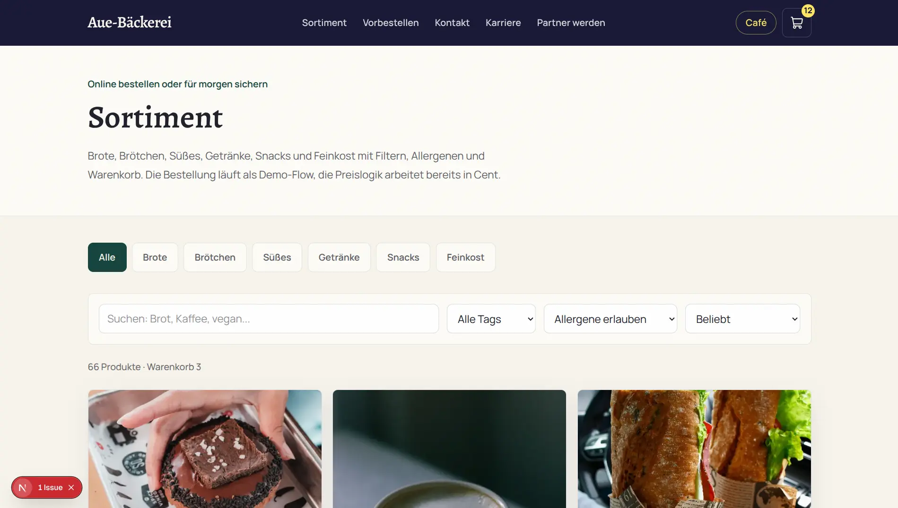
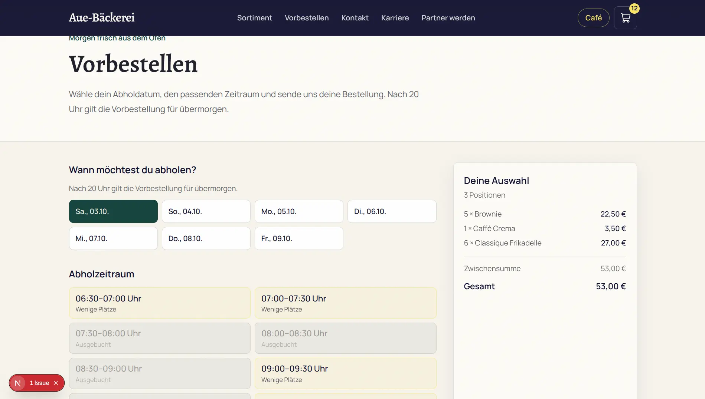
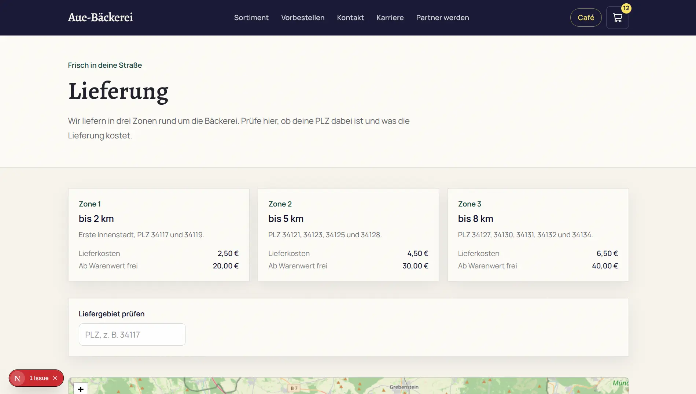
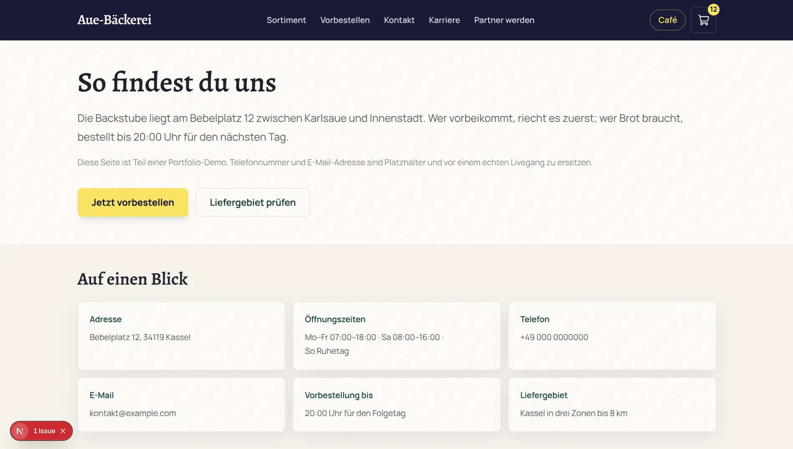
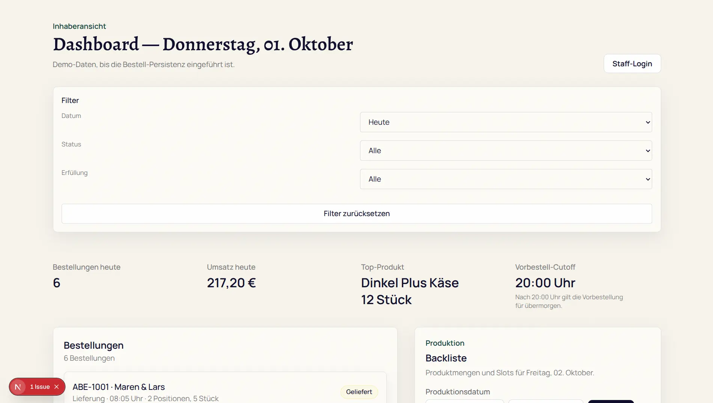
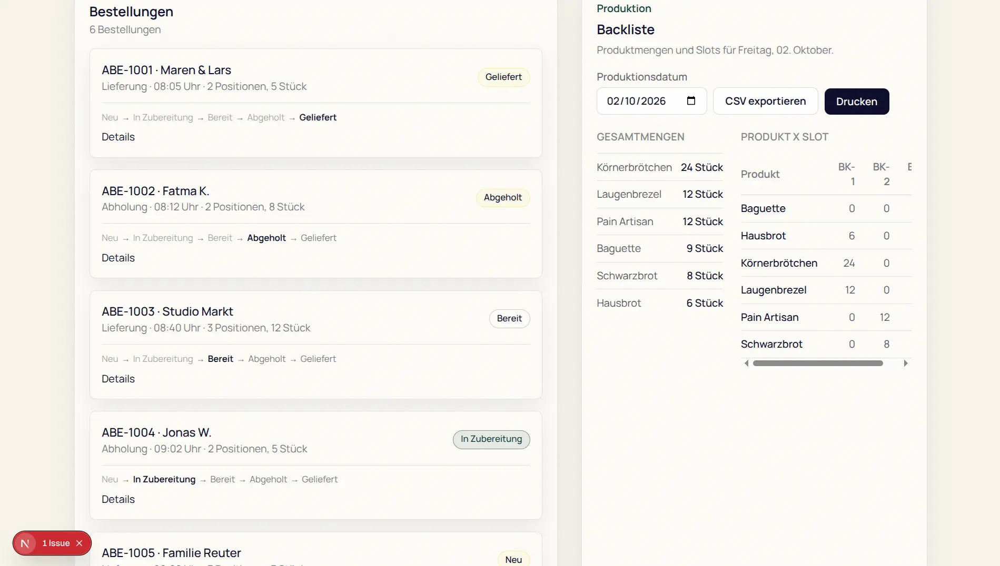

<div align="center">

# Aue-Bäckerei Kassel

**Handwerkliche Backwaren entdecken, vorbestellen und für den nächsten Tag vorbereiten.**


</div>

---

## Überblick



A portfolio project for a modern craft bakery in Kassel. The site combines a
video-led landing page with a multilingual catalogue, shared cart, preorder
flow, local delivery content, legal pages, and a production-focused admin
backliste.

It is derived from a reusable infrastructure base and now owns its bakery
domain, SDD artifacts, feature tickets, and visual language.

## Der Ablauf

```
Startseite entdecken -> Sortiment durchsuchen -> Produkte in den Warenkorb
       -> Abholung oder Lieferung wählen -> Vorbestellung absenden
       -> Team bereitet die Backliste für den Produktionstag vor
```

## Screenshots

### Public site

| Homepage | Footer |
| --- | --- |
|  |  |

| Sortiment | Vorbestellen |
| --- | --- |
|  |  |

| Lieferung | Kontakt |
| --- | --- |
|  |  |

### Admin

| Dashboard | Backliste and operations |
| --- | --- |
|  |  |

## What is inside

- Next.js App Router, React, TypeScript, Tailwind CSS v4
- next-intl with German as canonical language and English/Ukrainian locales
- Shared cart and preorder flow with quantity-aware cart badge
- Supabase/Postgres infrastructure for staff authentication and admin workflows
- German legal shell with Impressum and Datenschutz routes
- SDD docs in `docs/sdd/`
- first hero assets at `public/hero-oven.mp4` and `public/hero-oven.jpg`

## Product flow

1. Discover the bakery and its local Kassel positioning on the homepage.
2. Browse and filter products in the catalogue.
3. Add products to the shared cart from catalogue cards or product detail pages.
4. Choose pickup or delivery in the preorder flow.
5. Staff use the admin backliste to prepare the next production day.

The project is a portfolio/demo implementation. Payment, customer accounts,
and external integrations are intentionally feature-gated rather than enabled
by default.

## Setup

```bash
npm install
cp .env.example .env.local          # fill in URL, SITE_NAME, DEV_DATABASE_NAME, DATABASE_URL
createdb aue_beckerei
npm run db:local:migrate
npm run db:local:seed
npm run dev
```

`db:local:migrate` reads `DATABASE_URL` and `DEV_DATABASE_NAME` from
`.env.local`, so no inline environment variable is needed. Supabase is not
required to run the public site or the demo catalogue; it is only needed once
staff auth is wired up.

For the tests, create a second, disposable database:

```bash
createdb aue_beckerei_test
printf 'APP_ENV=test\nTEST_DATABASE_NAME=aue_beckerei_test\nTEST_DATABASE_URL=postgresql://<user>@/aue_beckerei_test?host=/var/run/postgresql\n' > .env.test.local
```

`npm run check` also runs unit and integration tests. Database-backed tests need
the local test database described in `.env.example`.

## Workflow

One ticket is one branch and one PR. Branches are `feature/abe-<n>-<slug>`,
matching the ticket ID in `docs/sdd/tickets/`. `npm run check` must be green
before a PR is opened; CI runs the same command plus `npm run build`.

```bash
git checkout -b feature/abe-010-cart-drawer
```

Never commit feature work directly to `main`.

## Environment

Two values are required for the database scripts to run at all, and they exist
to stop a mistake from destroying real data:

- `DEV_DATABASE_NAME` — the local dev database. `npm run db:local:*` refuses any
  other database name and refuses non-local hosts.
- `TEST_DATABASE_NAME` — the disposable test database. The integration suite
  drops `public` between files, so it refuses any other name and any remote
  host, including Supabase.

Optional integrations are grouped. A group is off by default; enabling one
makes its keys mandatory, and `assertEnvGroup()` in `src/lib/env/groups.ts`
turns a half-configured group into an actionable error instead of a runtime
mystery:

```bash
ENABLE_EMAIL=true   # then BREVO_API_KEY is required
```

No optional group has a production call site yet. Enable integrations only when
their feature ticket needs them.

## Conventions

`AGENTS.md` and the workspace rules hold the coding contract. `docs/sdd/` holds
the product contract and ticket scope.

## Verification

```bash
npm run check
npm run build
```

The check suite covers linting, type checking, unit tests, and integration tests
against the disposable local test database.

## Licence and provenance

Built from the author's own reusable infrastructure base. Replace placeholder
photos/assets with owned or properly licensed material before any commercial
use.
